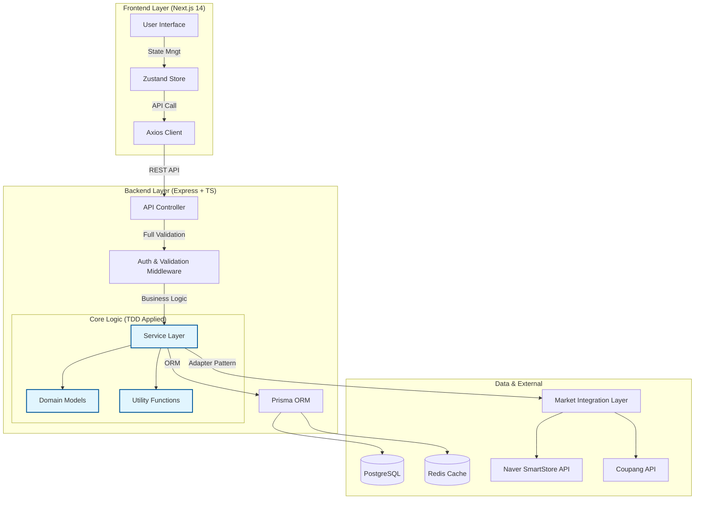

# 🚀 OmniSeller Desk

> **오픈마켓 셀러를 위한 지능형 상품 통합 관리 플랫폼**  
> *"복잡한 상품 등록은 이제 그만. OmniSeller Desk로 한 번에, 똑똑하게."*

---

## � Project Introduction

**OmniSeller Desk**는 여러 오픈마켓(네이버 스마트스토어, 쿠팡 등)을 운영하는 셀러들의 비효율적인 업무를 자동화하는 **SaaS형 통합 관리 솔루션**입니다.

기존의 단순 반복적인 상품 등록 업무에서 벗어나, **하나의 대시보드에서 모든 마켓의 상품을 관리**하고, **실시간 마진 계산**을 통해 수익성을 극대화할 수 있도록 돕습니다.

### 🌟 Why This Project is Special?

이 프로젝트는 단순한 기능 구현을 넘어 **소프트웨어 엔지니어링의 정수**를 담았습니다.

- **🛡️ Uncompromising Code Quality**: 모든 코어 비즈니스 로직은 **TDD(Test-Driven Development)**를 통해 검증되었으며, **테스트 커버리지 90% 이상**을 유지합니다.
- **�️ Solid Architecture**: **SOLID 원칙**을 철저히 준수하여 결합도는 낮추고 응집도는 높였습니다. 새로운 마켓이 추가되더라도 기존 코드를 수정할 필요 없는(OCP) 유연한 구조를 자랑합니다.
- **⚡ Performance First**: 최적화된 DB 쿼리와 캐싱 전략을 통해 대량의 상품 데이터도 즉각적으로 처리합니다.

---

## 🏛️ System Architecture

OmniSeller Desk는 **확장성**과 **유지보수성**을 최우선으로 설계되었습니다. 프론트엔드와 백엔드가 명확히 분리되어 있으며, 레이어드 아키텍처를 통해 비즈니스 로직을 보호합니다.

### 🧱 Architectural Highlights

1.  **Layered Architecture**: Controller, Service, Repository(Prisma) 계층을 엄격히 분리하여 관심사 분리(SoC) 실현.
2.  **Adapter Pattern**: 마켓 연동 로직에 어댑터 패턴을 적용하여, 새로운 쇼핑몰 추가 시 기존 로직 변경 없이 확장 가능 (Open/Closed Principle).
3.  **Atomic Design System**: 프론트엔드 컴포넌트의 재사용성을 극대화하기 위해 Atomic Design 방법론 적용.

---

## ✨ Key Features

### 1️⃣ Multi-Market Integration (다중 마켓 통합)
- **One-Click Publish**: 한 번의 상품 등록으로 네이버, 쿠팡 등 여러 마켓에 동시 송출.
- **Unified Sync**: 재고 및 주문 상태가 모든 마켓에 실시간으로 동기화됩니다.

### 2️⃣ Smart Margin Calculator (지능형 마진 계산기)
- **Real-time Analyze**: 매입가, 판매가, 마켓별 수수료를 즉시 분석하여 정확한 순이익을 계산.
- **Profit Alert**: 목표 마진율 미달 시 경고 알림 제공.

### 3️⃣ Advanced Product Search & Filtering (고급 상품 검색 및 필터링)
- **Smart Search**: 상품명과 설명에서 대소문자 구분 없이 검색 가능.
- **Multi-Filter**: 카테고리, 가격 범위, 재고 상태 등 다양한 조건으로 필터링.
- **Flexible Sorting**: 이름, 가격, 재고, 생성일 기준으로 오름차순/내림차순 정렬.
- **Pagination**: 효율적인 페이지네이션으로 대량 데이터 처리.

### 4️⃣ Secure Authentication (강력한 보안 인증)
- **JWT & Encryption**: `Bcrypt`를 이용한 비밀번호 암호화 및 `JWT` 기반의 Stateless 인증 시스템.
- **Safe Architecture**: 민감 정보는 철저히 서버 사이드 환경변수로 관리 및 암호화 저장.

---

## 🛠️ Technology Stack

| Category | Technologies |
|----------|--------------|
| **Frontend** |     |
| **Backend** |    |
| **Database** |   |
| **DevOps** |    |
| **Test** |   |

---

## 📈 TDD & Quality Assurance

이 프로젝트는 **"테스트 없는 코드는 레거시(Legacy)다"**라는 철학 아래 개발되었습니다.

- **Unit Testing**: 모든 비즈니스 로직(Service, Utility)은 단위 테스트 통과 후 구현되었습니다.
- **Documentation**: 철저한 기술 문서화(Tech Spec, API Docs)를 통해 협업 효율성을 높였습니다.

---

## 🔗 Links

- [📄 MVP 개발 작업 목록](./docs/MVP_TASKS.md)
- [🔍 상품 검색 & 필터링 API 문서](./backend/docs/PRODUCT_SEARCH_API.md)
- [📏 TDD 규칙](./.agent/rules/tdd.md)
- [🏗️ SOLID 원칙](./.agent/rules/solid.md)

---

Copyright © 2025 OmniSeller Desk. All Rights Reserved.
